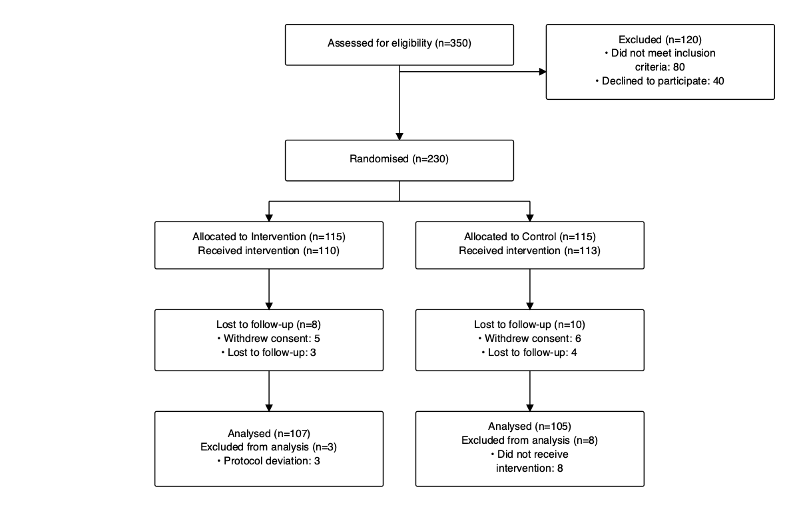
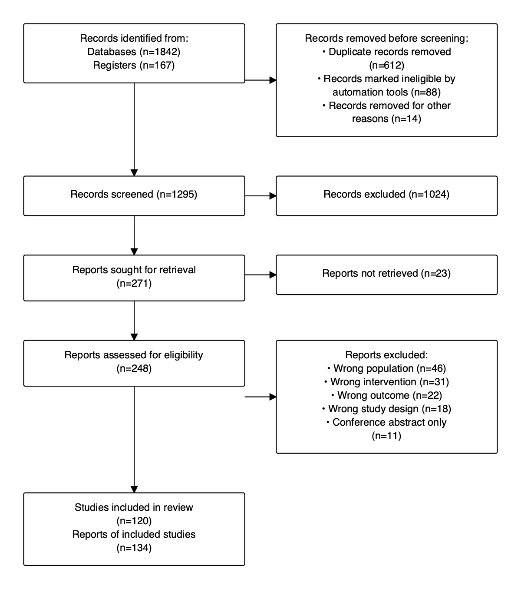
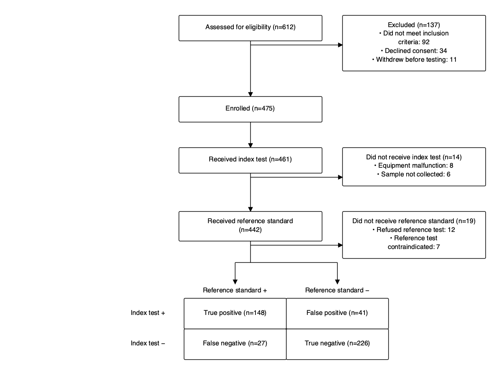
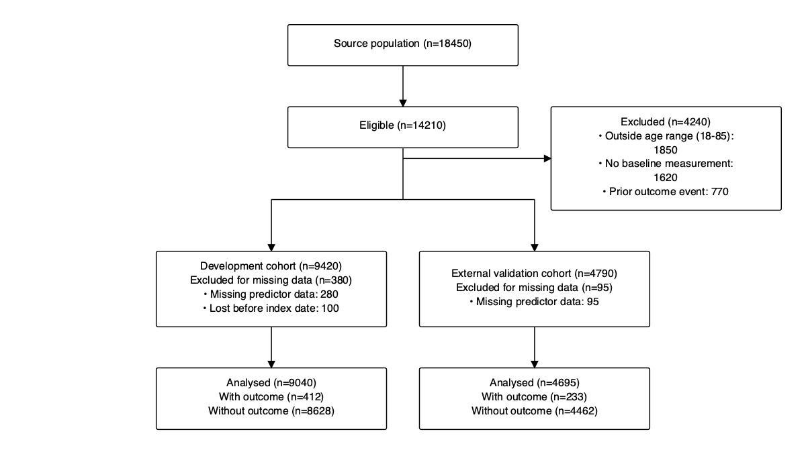
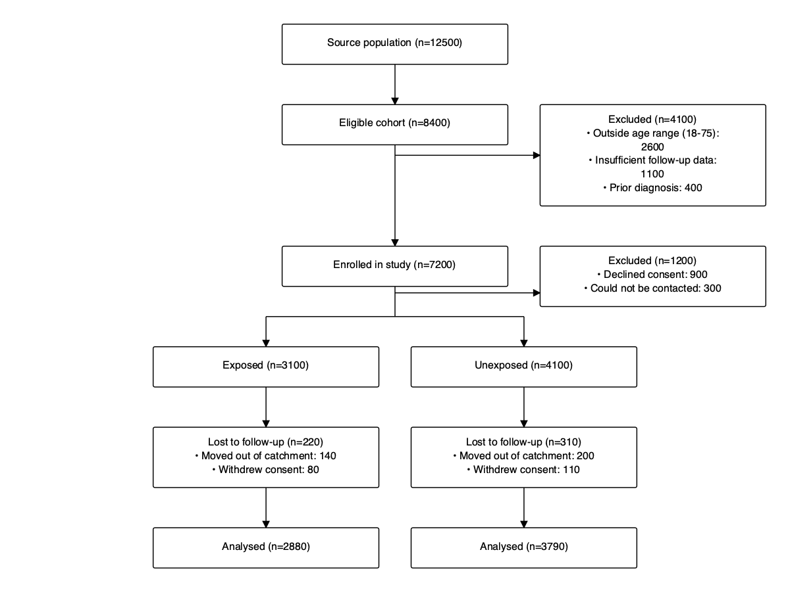

# Study Flow Extension For Quarto

[](LICENSE)
[](https://quarto.org)

A Quarto shortcode extension that renders **participant-flow diagrams**
for the major reporting guidelines straight from structured YAML in your
document frontmatter — no manual drawing, no Graphviz, no `rsvg-convert`,
no shell-outs. Diagrams are emitted as inline **SVG** for HTML output and
as native **TikZ** for LaTeX/PDF output, so the extension has zero runtime
dependencies beyond Quarto itself.

| `type:`   | Guideline                            | Used for                       |
| --------- | ------------------------------------ | ------------------------------ |
| `consort` | **CONSORT 2025** (supersedes 2010)   | Randomised controlled trials   |
| `strobe`  | STROBE                               | Observational studies          |
| `prisma`  | **PRISMA 2020**                      | Systematic reviews             |
| `tripod`  | **TRIPOD+AI 2024** (supersedes 2015) | Clinical prediction models     |
| `stard`   | **STARD 2015**                       | Diagnostic accuracy studies    |

## Preview

| CONSORT 2025                              | PRISMA 2020                              | STARD 2015                             |
| ----------------------------------------- | ---------------------------------------- | -------------------------------------- |
|     |      |      |

| TRIPOD+AI 2024                            | STROBE                                   |
| ----------------------------------------- | ---------------------------------------- |
|       |      |

## Installing

```bash
quarto add tiagojct/quarto-study-flow
```

This will install the extension under the `_extensions` subdirectory. If
you're using version control, you will want to check in this directory.

To update an existing install:

```bash
quarto update tiagojct/quarto-study-flow
```

To remove:

```bash
quarto remove tiagojct/quarto-study-flow
```

## Using

Declare the diagram in your document's YAML frontmatter under the
`study-flow` key, then drop the shortcode `` wherever
you want the figure to appear. Minimal CONSORT example:

````markdown
---
title: "My trial"
format: html
study-flow:
  type: consort
  enrollment:
    assessed: 350
    excluded: 120
    exclusion_reasons:
      - "Did not meet inclusion criteria: 80"
      - "Declined to participate: 40"
  randomised: 230
  groups:
    - label: "Intervention"
      allocated: 115
      lost_followup: 8
      analysed: 107
    - label: "Control"
      allocated: 115
      lost_followup: 10
      analysed: 105
---

The flow of participants is shown below.


````

Render with:

```bash
quarto render my-trial.qmd --to html
quarto render my-trial.qmd --to pdf
```

## Diagram types

### CONSORT (2025)

```yaml
study-flow:
  type: consort
  enrollment:
    assessed: 350
    excluded: 120
    exclusion_reasons:
      - "Did not meet inclusion criteria: 80"
      - "Declined to participate: 40"
  randomised: 230
  groups:
    - label: "Intervention"
      allocated: 115
      received: 110           # optional
      lost_followup: 8
      lost_reasons:
        - "Withdrew consent: 5"
        - "Lost to follow-up: 3"
      analysed: 107
      excluded_analysis: 3    # optional
      excluded_analysis_reasons:
        - "Protocol deviation: 3"
    - label: "Control"
      allocated: 115
      lost_followup: 10
      analysed: 105
```

The CONSORT layout follows the four canonical rows from the CONSORT 2025
statement (which supersedes CONSORT 2010 with no structural change to the
flow diagram): **Enrolment → Allocation → Follow-up → Analysis**, with a
side arrow from Enrolment to the *Excluded* box, and N parallel columns
(one per arm) under *Randomised*.

### STROBE

```yaml
study-flow:
  type: strobe
  source:
    label: "Source population"
    n: 12500
  eligible:
    label: "Eligible cohort"
    n: 8400
    excluded: 4100
    exclusion_reasons:
      - "Outside age range: 2600"
      - "Insufficient follow-up: 1100"
  enrolled:
    n: 7200
    excluded: 1200
  groups:
    - label: "Exposed"
      n: 3100
      lost_followup: 220
      analysed: 2880
    - label: "Unexposed"
      n: 4100
      lost_followup: 310
      analysed: 3790
```

The STROBE flow runs **Source → Eligible → Enrolled** as a vertical spine,
each stage with an optional *Excluded* sidebar. Below the spine the diagram
splits into N exposure / case-control columns with optional follow-up loss
and analysis rows, mirroring how cohort flow is conventionally drawn under
the STROBE statement.

`source`, `eligible`, `enrolled`, and `groups` are all individually optional
— omit any stage you don't need. At least one stage or group is required.

### PRISMA 2020

```yaml
study-flow:
  type: prisma
  identification:
    databases: 1842
    registers: 167
    duplicates_removed: 612
    ineligible_automation: 88
    other_removed: 14
  screening:
    screened: 1295
    excluded: 1024
    sought_retrieval: 271
    not_retrieved: 23
    assessed: 248
    excluded_with_reasons:
      - "Wrong population (n=46)"
      - "Wrong intervention (n=31)"
      - "Wrong outcome (n=22)"
  included:
    studies: 120
    reports: 134
```

The PRISMA layout follows the canonical PRISMA 2020 flow with five rows on
the main spine —
**Records identified → Records screened → Reports sought → Reports assessed
→ Studies included** — and *Excluded* / *Removed* boxes branching to the
right at each step. Any field you omit collapses the corresponding box.

### TRIPOD+AI

```yaml
study-flow:
  type: tripod
  source:
    label: "Source population"
    n: 18450
  eligibility:
    n: 14210
    excluded: 4240
    exclusion_reasons:
      - "Outside age range: 1850"
      - "No baseline measurement: 1620"
  cohorts:
    - label: "Development cohort"
      n: 9420
      excluded_missing: 380
      analysed: 9040
      events: 412
      no_events: 8628
    - label: "External validation cohort"
      n: 4790
      analysed: 4695
      events: 233
      no_events: 4462
```

TRIPOD+AI 2024 supersedes TRIPOD 2015 and applies to studies developing,
validating, or updating a clinical prediction model (whether regression or
machine-learning based). The diagram puts an optional **Source → Eligible**
spine at the top, then splits into 1+ parallel cohort columns (typically
*development* and *external validation*), each with its own outcome
breakdown row.

### STARD 2015

```yaml
study-flow:
  type: stard
  assessed: 612
  excluded: 137
  exclusion_reasons:
    - "Did not meet inclusion criteria: 92"
    - "Declined consent: 34"
  enrolled: 475
  index_test: 461
  not_index: 14
  not_index_reasons:
    - "Equipment malfunction: 8"
    - "Sample not collected: 6"
  reference_standard: 442
  not_reference: 19
  not_reference_reasons:
    - "Refused reference test: 12"
  outcomes:
    true_positive: 148
    false_positive: 41
    false_negative: 27
    true_negative: 226
```

The STARD layout follows the canonical STARD 2015 prototypical diagram
with a four-row spine —
**Assessed for eligibility → Enrolled → Received index test → Received
reference standard** — each with optional right-side *Excluded* / *Did not
receive* sidebars, and a 2×2 contingency grid at the bottom (TP / FP / FN
/ TN) with `Reference standard +/−` column headers and `Index test +/−`
row headers.

## Output formats

| Format            | Renderer              | Notes                                                                                                                  |
| ----------------- | --------------------- | ---------------------------------------------------------------------------------------------------------------------- |
| `html`            | inline SVG            | Scales to container; uses `text-anchor="middle"` and `preserveAspectRatio="xMidYMid meet"` for clean responsive layout. |
| `revealjs`        | inline SVG            | Same SVG output as `html`.                                                                                             |
| `pdf` / `latex`   | TikZ                  | Auto-loads `tikz`, `graphicx`, and the `arrows.meta` library. Wrapped in `\resizebox{\linewidth}{!}{...}` so it always fits the text width. Works with any LaTeX engine — no `rsvg-convert` required. |
| anything else     | inline SVG (fallback) |                                                                                                                        |

For PDF output, `pdf-engine: xelatex` is recommended in your document YAML
so that Unicode characters in box labels (bullets, en-dashes, the minus
sign in STARD's 2×2 grid) render natively without configuration.

## Examples

This repository ships ready-to-render examples:

- [`example-consort.qmd`](example-consort.qmd) — two-arm RCT
- [`example-strobe.qmd`](example-strobe.qmd) — cohort study
- [`example-prisma.qmd`](example-prisma.qmd) — systematic review
- [`example-tripod.qmd`](example-tripod.qmd) — prediction model with development + external validation cohorts
- [`example-stard.qmd`](example-stard.qmd) — diagnostic accuracy study with 2×2 contingency grid

Render any of them with:

```bash
quarto render example-consort.qmd --to html
quarto render example-consort.qmd --to pdf
```

## Field reference

### CONSORT

```
type: consort
enrollment:
  assessed:           number   # required
  excluded:           number   # required
  exclusion_reasons:  [string] # optional
randomised:           number   # required
groups:                        # required, 1+ entries
  - label:                       string  # required
    allocated:                   number  # required
    received:                    number  # optional
    not_received:                number  # optional
    lost_followup:               number  # optional (defaults to 0)
    lost_reasons:                [string]
    discontinued:                number  # optional
    discontinued_reasons:        [string]
    analysed:                    number  # required
    excluded_analysis:           number  # optional
    excluded_analysis_reasons:   [string]
```

### STROBE

```
type: strobe
source:    { label: string, n: number }                       # optional
eligible:  { label: string, n: number,
             excluded: number, exclusion_reasons: [string] }  # optional
enrolled:  { label: string, n: number,
             excluded: number, exclusion_reasons: [string] }  # optional
groups:                                                       # optional
  - label:         string
    n:             number
    lost_followup: number          # optional
    lost_reasons:  [string]
    analysed:      number
    excluded_analysis: number      # optional
    excluded_analysis_reasons: [string]
```

### PRISMA

```
type: prisma
identification:
  databases:              number
  registers:              number   # optional
  duplicates_removed:     number   # optional
  ineligible_automation:  number   # optional
  other_removed:          number   # optional
screening:
  screened:               number   # optional
  excluded:               number   # optional (sidebar to screened)
  sought_retrieval:       number   # optional
  not_retrieved:          number   # optional (sidebar to sought_retrieval)
  assessed:               number   # optional
  excluded_with_reasons:  [string] # optional (sidebar to assessed)
included:
  studies:                number   # optional
  reports:                number   # optional
```

### TRIPOD+AI

```
type: tripod
source:                                    # optional
  label:               string
  n:                   number
eligibility:                               # optional
  label:               string
  n:                   number
  excluded:            number              # optional
  exclusion_reasons:   [string]            # optional
cohorts:                                   # required, 1+ entries
  - label:                       string
    n:                           number
    excluded_missing:            number    # optional
    excluded_missing_reasons:    [string]  # optional
    analysed:                    number    # optional
    events:                      number    # optional
    no_events:                   number    # optional
```

### STARD

```
type: stard
assessed:                  number          # required
excluded:                  number          # optional (sidebar)
exclusion_reasons:         [string]
enrolled:                  number          # required
index_test:                number          # optional, defaults to enrolled
not_index:                 number          # optional (sidebar)
not_index_reasons:         [string]
reference_standard:        number          # optional, defaults to index_test
not_reference:             number          # optional (sidebar)
not_reference_reasons:     [string]
outcomes:                                  # required
  true_positive:           number
  false_positive:          number
  false_negative:          number
  true_negative:           number
```

## Reporting guideline references

- **CONSORT 2025** — Hopewell S et al. *CONSORT 2025 statement: updated
  guideline for reporting randomised trials.* The Lancet, 2025.
  <https://www.consort-spirit.org>
- **STROBE** — von Elm E et al. *Strengthening the Reporting of Observational
  Studies in Epidemiology (STROBE).* Ann Intern Med, 2007.
  <https://www.strobe-statement.org>
- **PRISMA 2020** — Page MJ et al. *The PRISMA 2020 statement: an updated
  guideline for reporting systematic reviews.* BMJ, 2021.
  <https://www.prisma-statement.org>
- **TRIPOD+AI 2024** — Collins GS et al. *TRIPOD+AI statement: updated
  guidance for reporting clinical prediction models that use regression or
  machine learning methods.* BMJ, 2024.
  <https://www.tripod-statement.org>
- **STARD 2015** — Bossuyt PM et al. *STARD 2015: an updated list of
  essential items for reporting diagnostic accuracy studies.* BMJ, 2015.
  <https://www.equator-network.org/reporting-guidelines/stard/>

## License

[MIT](LICENSE) © Tiago Jacinto
